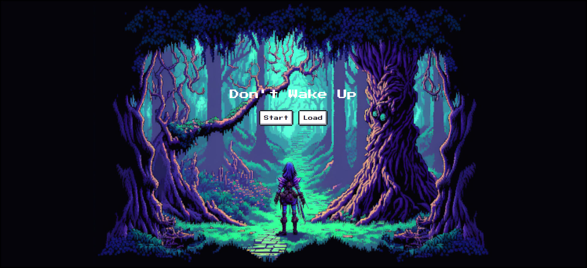
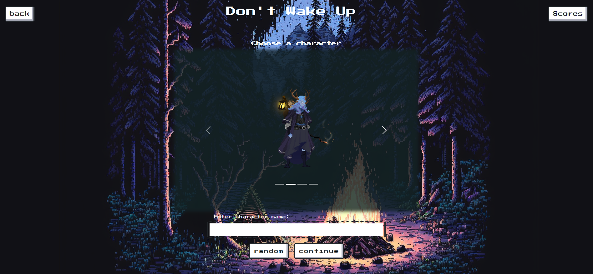
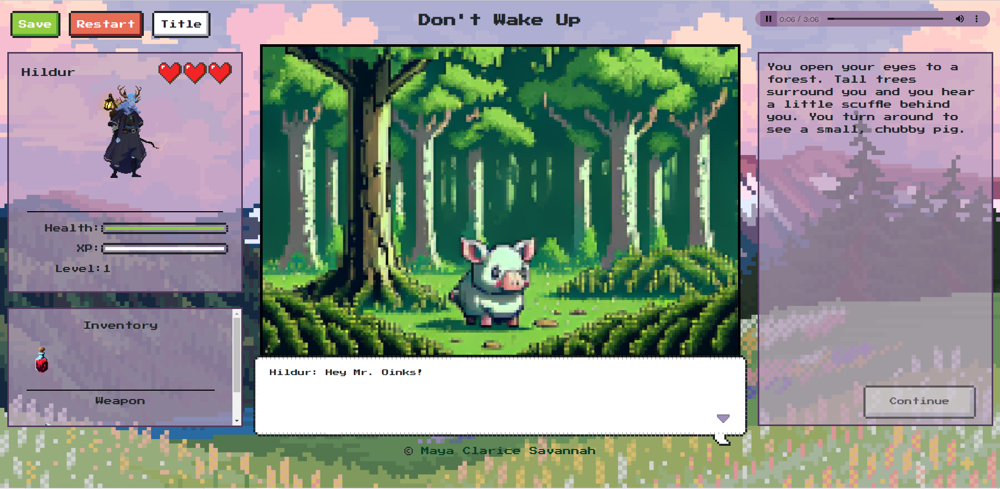
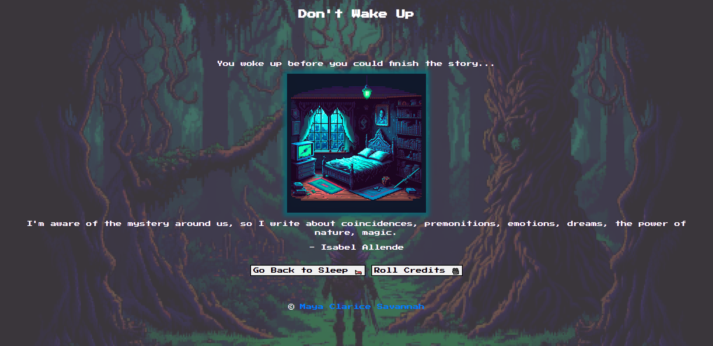

# Don't Wake Up

## Description

Don't Wake Up is a story based RPG game in which we traverse to a players dream and follow their quest to find their lost pet pig. This project aims to show all of the skills we have learned the last 6 weeks in the University of Washington Coding Bootcamp. This application uses all of the core concepts/languages covered during this time, such as HTML, CSS, JavaScript, jQuery, and JSON. Learning these concepts in such a fast-paced environment can be difficult and what better way to relax while still practicing problem solving skills than playing a video game! We wanted to show that while coding can be challenging, it can also be very fun and rewarding!

## Installation

No installation is necessary! Please view the link to our deployed application here: https://claricetran.github.io/dont-wake-up/

## Usage

Bored or stressed? Take some time to play a mellow, story driven rpg game. Simply click our deployed link and click "Start" to begin your adventure! Choices and prompts are all click based. Don't forget to save your progress periodically by clicking the "save" button! When you finish the game, you will be able to save your score to the scoreboard. If you need to quit part-way through, feel free to save and return. Clicking "load" on the start screen will return you to your last saved checkpoint. Students and new developers may find it helpful and worthwhile to review the code in the repository to see how all of these concepts came together to create a functional game. Code has been commented for clarity. You gae is saved via local storage. To view a current save, please open up Chrome DevTools and navigate to the "Application" tab and view content under "local storage".

## Credits

**Developers**  

Savannah Miller: https://github.com/VisualViolet  

Maya Cohen (Project Manager): https://github.com/Mayalynn96

**NES CSS** (CSS Framework): https://nostalgic-css.github.io/NES.css/  

**Midjourney AI** (Art): https://midjourney.com/home/?callbackUrl=%2Fapp%2F  

**Reroll** (Characters): https://reroll.co/  

**API Ninja's** (Quote API): https://api-ninjas.com/api/quotes  

**Ninble BV** (Name Parser API): https://parser.name/api/  

**PGN Music** (Music): https://pgnmusic.com/  

## License

Please view the license in the repo for more information.

